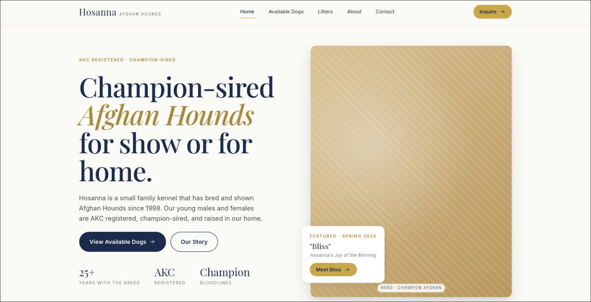

# Hosanna Afghan Hounds - Concept Redesign

My concept redesign of [hosanna1.com](https://hosanna1.com), an Afghan Hound breeder website running since 1998. Built as my final project for the **Human-Computer Interaction (IMK)** course.

What's in here:

1. **User Persona** - 3 personas: a first-time buyer, a seasoned dog lover, and a researcher
2. **Empathy Map Canvas (EMC)** - what each persona thinks, feels, sees, and struggles with
3. **Customer Journey Map (CJM)** - the full journey from first click to after care
4. **Problem Statement** - the key issues that shaped the redesign

> ⚠️ **Disclaimer** - This is an independent design study for my portfolio. **Not affiliated with,
> commissioned by, or endorsed by** Hosanna Afghan Hounds. All brand references remain
> the property of their owner. Original site: [hosanna1.com](https://hosanna1.com).

---

## Before → After

| Original (1998-era) | Redesign concept |
| --- | --- |
|  |  |

> See the [live demo](https://nashirulwan.github.io/hosanna-redesign/) for the full interactive experience.

---

## Wireframes

The redesign started with low-fidelity wireframes to explore multiple layout directions before committing to a final design.

### Homepage Directions (4 Concepts)

| A - Editorial | B - Photo Mosaic | C - Story Split | D - Bold Type |
| --- | --- | --- | --- |
|  |  |  |  |

> Each direction uses the same content but with a very different visual posture, from editorial to photo-driven to type-focused.

### Available Dogs

| A - Filtered Grid | B - Empty + Waitlist |
| --- | --- |
|  |  |

> Filterable grid for browsing dogs, plus empty state with waitlist signup.

### Dog Profile

| A - Two-Column Classic | B - Editorial Full-Bleed |
| --- | --- |
|  |  |

> Two layout options: structured two-column vs full-bleed editorial.

### Contact

| A - Form + Kennel Info | B - Review Step |
| --- | --- |
|  |  |

> Contact flow with form + confirmation step before sending.

---

## What's in here

| Stage | File | What's inside |
| --- | --- | --- |
| **Hi-fi prototype** | [`index.html`](index.html) | The final interactive redesign, Home, Available Dogs, Dog Profile, Contact. |
| **Wireframes** | [`wireframes.html`](wireframes.html) | Low-fidelity exploration: layout directions, design tokens, mobile sketches. |
| Hi-fi source | `hi-fi/` | Components, page code, CSS design tokens, sample data. |
| Wireframe source | `wireframes/` | The sketch-style component library and page variants. |
| Reference | `docs/` | Screenshots of the original site, wireframes, and hi-fi redesign. |
| Archive | `archive/` | Earlier intermediate exports, kept for history, not used by the live pages. |

---

## Redesign Process

### 1. 17 UI/UX Principles Analysis

I ran the original [hosanna1.com](https://hosanna1.com) through 17 UI/UX principles to spot what wasn't working:

| No | Principle | Description |
| --- | --- | --- |
| 1 | **User Compatibility** | Fits what users need, colors, sizing, readability, fonts |
| 2 | **Product Compatibility** | The design matches what the product is meant to do |
| 3 | **Task Compatibility** | Helps users get their tasks done |
| 4 | **Workflow Compatibility** | Matches how people naturally work |
| 5 | **Simplicity** | Simple and straightforward |
| 6 | **Consistency** | Same look and feel across the product |
| 7 | **Familiarity** | Follows patterns users already know |
| 8 | **Flexibility** | Works for different types of users |
| 9 | **Responsiveness** | Quick to react to what users do |
| 10 | **Control** | Built-in safeguards to catch mistakes early |
| 11 | **Robustness** | Handles errors and edge cases gracefully |
| 12 | **Protection** | Users feel safe even when things go wrong |
| 13 | **WYSIWYG** | What You See Is What You Get, what you edit is what you get |
| 14 | **Direct Manipulation** | Direct tools for interaction and customization |
| 15 | **Invisible Technology** | The tech stays out of the way |
| 16 | **Ease of Learning** | Quick to pick up |
| 17 | **Ease of Use** | Simple to use |

### 2. User Personas

| Persona | Who they are |
|---------|-------------|
| **Prospective Buyer** | First-timer looking for a quality Afghan Hound |
| **Dog Lover** | Already has dogs, wants to browse and compare bloodlines |
| **Researcher/Breeder** | Needs structured data on bloodlines for academic work |

### 3. Empathy Map Canvas (EMC)

For each persona, I mapped out six dimensions:
- **Think & Feel:** What are they thinking and feeling?
- **See:** What do they see around them?
- **Hear:** What do they hear from others?
- **Say & Do:** What do they say and do?
- **Pain:** What frustrates them?
- **Gain:** What do they hope for?

### 4. Customer Journey Map (CJM)

The full user journey:

```
Aware → Consider → Contact → Adopt → After Care
  │         │          │         │         │
  ▼         ▼          ▼         ▼         ▼
Google    Browse     Submit    Receive   Follow
Search    Collection Form      Dog       Up
```

### 5. Problem Statement

From the analysis, here's what mattered most:

> **The original website is not mobile-friendly, has complex navigation, and fails to build trust.**
> Users struggle to find contact information, view the dog collection, and understand
> the adoption/purchase process.

---

## Design Approach

I kept it simple and trustworthy:

- **Kept the original identity**, AKC registered, champion-sired hounds, breeding since 1998, Psalm 23 motto, and the real contact email
- **One clear path**, single contact flow, one-step form
- **Human tone**, sounds like a breeder family talking, not a marketing team
- **Design system**, navy/gold/off-white palette, 8px spacing, Playfair Display + Inter fonts

> Dog names, photos, and litter details in the prototype are **placeholders**, ready to swap in real content.

---

## Tech

No build step needed, everything runs straight in the browser:

- **React 18** + **Babel Standalone** (via CDN)
- Plain **CSS** with custom properties
- Fonts from Google Fonts

---

## Run it locally

```bash
npx serve .
```

Then open:

- **Hi-fi redesign** → http://localhost:3000/index.html
- **Wireframes** → http://localhost:3000/wireframes.html

(Any static file server works, just serve over HTTP, not `file://`, since it fetches `.jsx` sources.)
