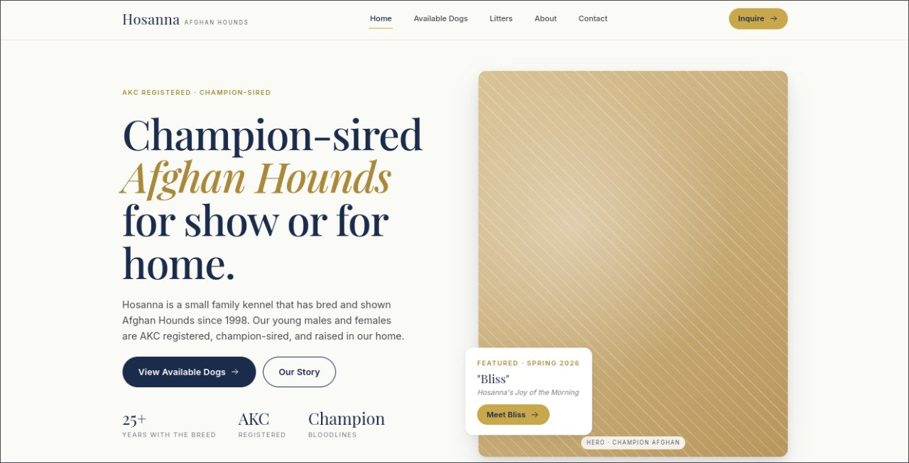
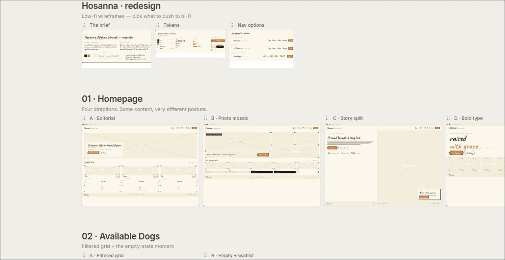
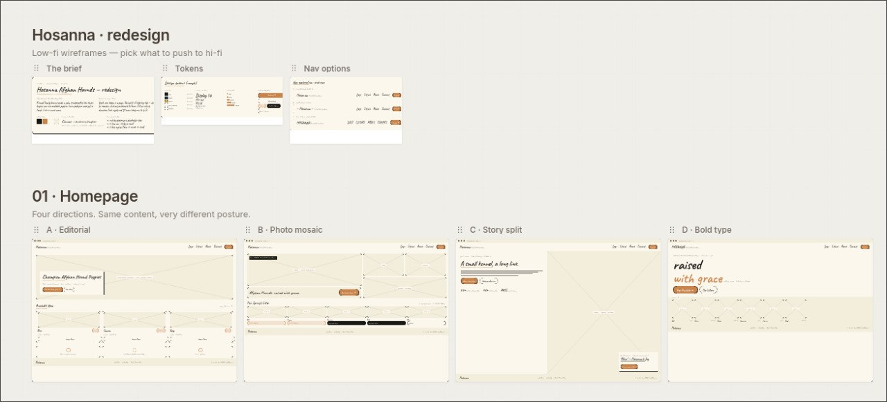
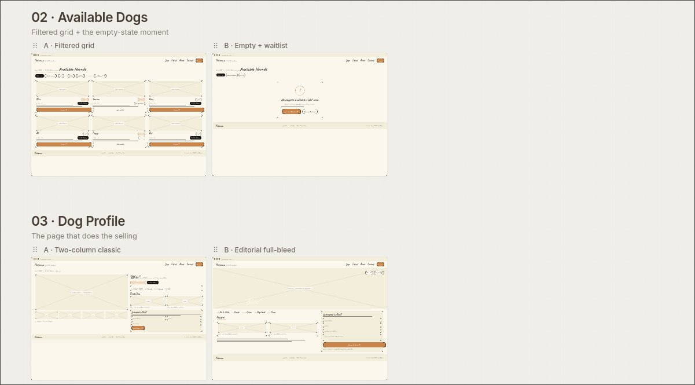
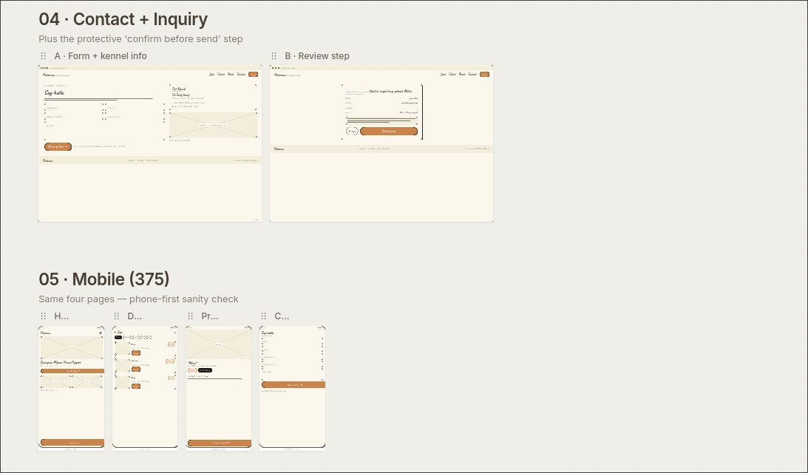

# Hosanna Afghan Hounds — Concept Redesign

Final project for **Human-Computer Interaction (IMK)** course — a redesign of [hosanna1.com](https://hosanna1.com), an Afghan Hound breeder website that has been running since 1998 with a late-1990s design.

This redesign is based on an analysis of **17 UI/UX principles** and includes:

1. **User Persona** — 3 user personas (potential buyer, dog lover, researcher/breeder)
2. **Empathy Map Canvas (EMC)** — feelings, thoughts, behaviors, and pain points for each persona
3. **Customer Journey Map (CJM)** — user journey from aware → consider → adopt → after care
4. **Problem Statement** — high-priority issues that became the basis for redesign

> ⚠️ **Disclaimer** — This is an independent design study for portfolio purposes. It is **not
> affiliated with, commissioned by, or endorsed by** Hosanna Afghan Hounds. All brand
> references remain the property of their owner. The original site lives at
> [hosanna1.com](https://hosanna1.com).

---

## Before → After

| Original | Redesign concept |
| --- | --- |
|  |  |

> See the [live demo](https://nashirulwan.github.io/hosanna-redesign/) or check `docs/after-redesign.png`.

---
## Wireframes

The redesign started with low-fidelity wireframes to explore multiple layout directions before committing to a final design.

### Design Exploration

| The Brief | Design Tokens | Nav Options |
| --- | --- | --- |
|  |  | |

### Homepage Directions (4 Concepts)

| A - Editorial | B - Photo Mosaic | C - Story Split | D - Bold Type |
| --- | --- | --- | --- |
| Classic magazine layout with hero text, stats, and news grid. | Image-focused with mosaic grid and visual storytelling. | Split-column with large headline and intimate text/image balance. | Typography-first with bold script and minimal placeholders. |

> Each direction uses the same content but with a very different visual posture — from editorial to photo-driven to type-focused.

### Available Dogs & Dog Profile

| Available Dogs | Dog Profile |
| --- | --- |
|  | |

> Filterable grid for browsing dogs, empty state with waitlist, and two profile layout options — structured two-column vs full-bleed editorial.

### Contact & Mobile

| Contact Flow | Mobile (375px) |
| --- | --- |
|  | |

> Contact flow with form + confirmation step, and mobile-first sanity check across all 4 main pages.


## What's in here

| Stage | File | What it is |
| --- | --- | --- |
| **Hi-fi prototype** | [`index.html`](index.html) | The final interactive redesign — Home, Available Dogs, Dog Profile, Contact. |
| **Wireframes** | [`wireframes.html`](wireframes.html) | Low-fidelity exploration: layout directions, design tokens, mobile sketches. |
| Hi-fi source | `hi-fi/` | Components, page code, CSS design tokens, sample data. |
| Wireframe source | `wireframes/` | The sketch-style component library and page variants. |
| Reference | `docs/` | Screenshot of the original site. |
| Archive | `archive/` | Earlier intermediate exports — kept for history, not used by the live pages. |

---

## Redesign Process

### 1. 17 UI/UX Principles Analysis

The original [hosanna1.com](https://hosanna1.com) was analyzed against 17 UI/UX principles to identify design weaknesses:

| Principle | Issue on Original Site |
|-----------|------------------------|
| **Visibility of system status** | No active page indicator |
| **Match between system and real world** | Technical language, not human-friendly |
| **User control and freedom** | Complex navigation, hard to go back |
| **Consistency and standards** | Inconsistent design across pages |
| **Error prevention** | No form validation |
| **Recognition rather than recall** | Scattered information, requires memorization |
| **Flexibility and efficiency of use** | No shortcuts or quick access |
| **Aesthetic and minimalist design** | Too many elements, not focused |
| **Help users recognize, diagnose, and recover from errors** | No clear error messages |
| **Help and documentation** | No user guide |

### 2. User Persona (3 People)

| Persona | Description |
|---------|-------------|
| **Potential Buyer** | Looking for a quality Afghan Hound to keep as a pet |
| **Dog Lover** | Wants to adopt or simply browse the collection |
| **Researcher/Breeder** | Seeking information about lineage and breeder reputation |

### 3. Empathy Map Canvas (EMC)

Each persona was analyzed for:
- **Think & Feel:** What are they thinking and feeling?
- **See:** What do they see around them?
- **Hear:** What do they hear from others?
- **Say & Do:** What do they say and do?
- **Pain:** What frustrates them?
- **Gain:** What do they hope for?

### 4. Customer Journey Map (CJM)

User journey from start to finish:

```
Aware → Consider → Contact → Adopt → After Care
  │         │          │         │         │
  ▼         ▼          ▼         ▼         ▼
Google    Browse     Submit    Receive   Follow
Search    Collection Form      Dog       Up
```

### 5. Problem Statement

Based on the 17-principle analysis, the **high-priority issue** that became the basis for redesign:

> **The original website is not mobile-friendly, has complex navigation, and fails to build trust.**
> Users struggle to find contact information, view the dog collection, and understand
> the adoption/purchase process.

---

## Design Approach

The redesign focuses on simplicity and trust:

- **Kept the real identity** — AKC registered, champion-sired hounds for show or pet, breeding online since 1998, the kennel's own Psalm 23 motto (*"I will fear no evil"*), and the real contact email.
- **Simplified the journey** — one clear inquiry path instead of several scattered forms; a single-step contact form instead of a multi-step flow.
- **Plain, human copy** — written the way a small family kennel actually speaks, not marketing filler.
- **A reusable design system** — navy / gold / off-white palette, an 8px spacing rhythm, and a Playfair Display + Inter type pairing, all defined as CSS tokens in `hi-fi/styles.css`.

> Dog names, photos, and litter details in the prototype are **illustrative placeholders** —
> meant to show the layout, ready to be swapped for the kennel's real content.

---

## Tech

No build step. Everything runs straight in the browser:

- **React 18** + **Babel Standalone** (loaded from CDN)
- Plain **CSS** with custom properties (design tokens)
- Fonts via Google Fonts

---

## Run it locally

```bash
npx serve .
```

Then open:

- **Hi-fi redesign** → http://localhost:3000/index.html
- **Wireframes** → http://localhost:3000/wireframes.html

(Any static file server works — the pages just need to be served over HTTP, not opened as
`file://`, because they fetch the `.jsx` sources.)
